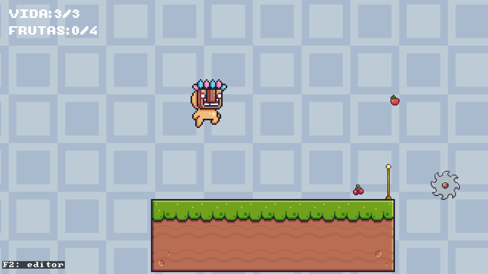
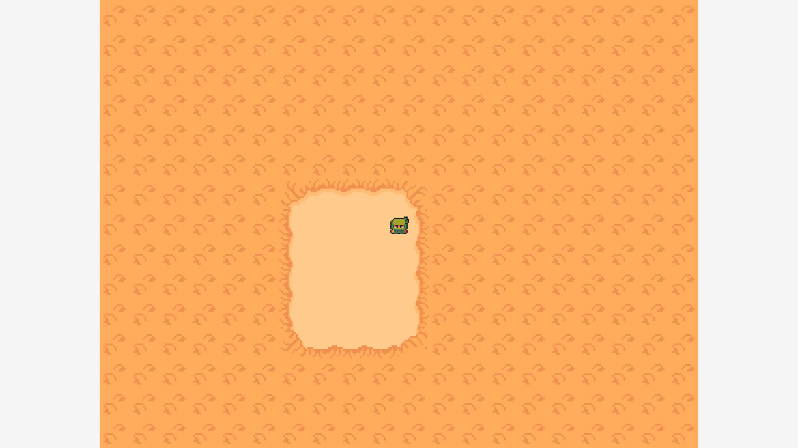
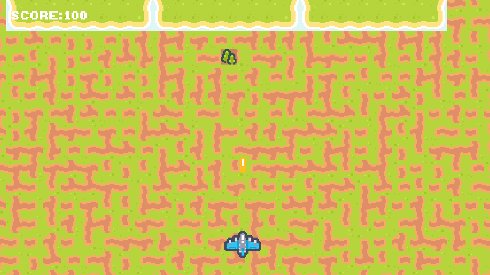
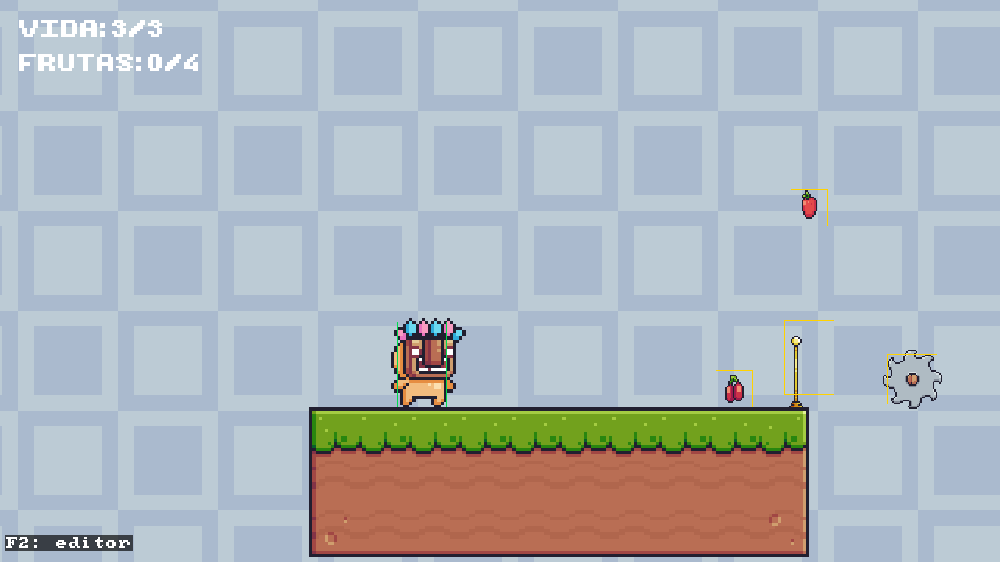
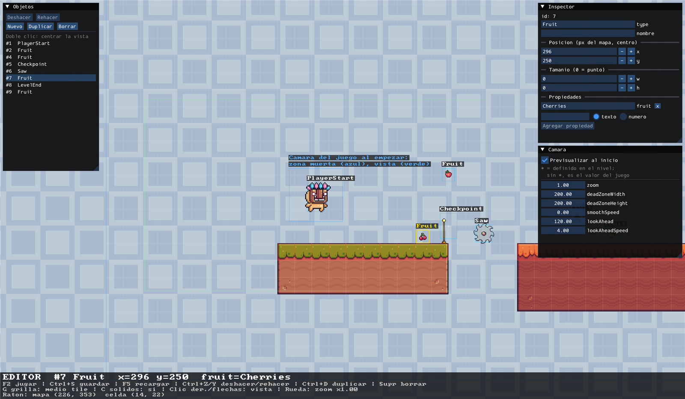

# sdl_game_engine — Motor 2D educativo sobre SDL3

Motor de videojuegos **2D ligero, estilo componentes** (similar a Unity), construido sobre
**SDL3**. Su propósito es educativo: que estudiantes que ya conocen SDL3 básico (ventana,
renderer, eventos, delta time) creen juegos **agregando componentes a objetos**, sin pelear
con la API cruda de SDL.

El motor no toma el control: tú mantienes tu propio bucle `main` de SDL y en cada frame
"bombeas" la escena (`scene->update(dt)` y `scene->render()`). El motor te entrega el sistema
de objetos/componentes que se actualiza y dibuja.

Este repositorio es la **base de un curso** de desarrollo de videojuegos. Cada sesión suma una
capacidad nueva al motor.



| Top-down (`2`) | Shooter (`3`) |
|---|---|
|  |  |

---

## Características

Lo que el motor ya hace hoy:

**Núcleo**

- **Sistema de componentes** estilo Unity: `GameObject` + `Transform` + componentes con ciclo
  de vida `awake` / `start` / `update` / `render` / `onCollision`. `start` corre una sola vez,
  en el primer `update`, cuando el objeto ya tiene todos sus componentes. Los componentes se
  recorren en **orden de inserción** (determinista). El `Transform` marca el **centro** del
  objeto.
- **Tags y capas de dibujo**: `GameObject::tag` clasifica ("Player", "Enemy", "Hazard"…) y los
  componentes genéricos filtran con `compareTag`, nunca por `name`. `sortingOrder` decide qué
  se dibuja delante.
- **Ciclo de vida**: `destroy` diferido, `Lifetime` (autodestrucción por tiempo) y `Spawner`.
- **`Input` consultable**: clase estática con `isDown` / `wasPressed` / `wasReleased` /
  `axis`, ratón y rueda, y un `enum class Key` propio (`Key::Space`, no `SDL_SCANCODE_SPACE`).
- **`AssetManager`**: dueño de las **texturas** (cargadas con filtro *nearest*, para pixel art
  sin sangrado) y de las **fuentes** (`loadFont(ruta, tamaño)`); los renderers solo las piden
  prestadas.

**Render y cámara**

- **Sprites**: `SpriteRenderer` con recortes, flip horizontal, anclaje al centro y `visible`.
- **Animación por spritesheet**: `SpriteAnimator` con celdas numeradas de un solo sheet, una
  tira (un archivo) por animación, o una fila/columna de un sheet en grilla (personajes
  direccionales). Clips de un solo uso con `isFinished()` y `setOnComplete(cb)`.
- **`AnimatorStateMachine`**: elige el clip con reglas `(clip, condición)` por prioridad.
- **Cámara**: `Camera` + `FollowCamera` con zona muerta, suavizado, límites del mapa y
  *look-ahead*. **`ParallaxBackground`** para fondos que se mueven más lento que la cámara.
- **Texto y HUD**: `TextRenderer` (vía **SDL3_ttf**) en pantalla o en el mundo, con
  alineación, fuente pixel nítida y *dirty flag* (solo regenera la textura si cambia el texto).

**Física**

- **AABB**: `RigidBody2D` + `BoxCollider` con gravedad, colisiones, triggers y `grounded`.
- **`PlatformerMotor`**: personaje de plataformas genérico. El juego le dice la *intención*
  (mover, saltar) y el motor aplica aceleración y frenado, altura de salto en píxeles, salto
  corto al soltar, *coyote time*, *jump buffer* y saltos en el aire.
- **`TilemapCollider`**: los tiles frenan sin crear un collider por tile; la física le
  pregunta al mapa y separa eje por eje (sin engancharse en las costuras entre tiles).

**Mapas y niveles**

- **Tilemap**: `TilemapRenderer` cargable desde **código**, desde un **archivo de texto propio**
  (`.map`) o desde **Tiled JSON** con tileset embebido y **varias capas** (visibilidad,
  opacidad, capas decorativas sin colisión). Culling de celdas fuera de pantalla.
- **Capa de objetos de Tiled**: `TiledObjectLayer` lee las capas *objectgroup* como **datos
  planos** (`TiledObject`). El motor no sabe qué significa cada `type`: la fábrica vive en el
  juego.
- **Archivo de nivel** `.level.json` (`LevelData`): objetos y ajustes de cámara, separado del
  mapa de Tiled. Tiled escribe el mapa; el editor del motor escribe el nivel.
- **Editor de niveles** (`F2`) con paneles de **Dear ImGui**: seleccionar, arrastrar, crear,
  duplicar, borrar y editar propiedades de los objetos, ajustar la cámara, deshacer/rehacer y
  guardar. Ver [Editor de niveles](#editor-de-niveles-f2).

**Reglas de juego reutilizables**

- `Health` (vida, invulnerabilidad temporal y parpadeo), `Hazard` (daño al contacto con
  empujón), `Collectible` (recoger con callback), `Checkpoint` + `Respawn` (muerte en dos
  tiempos y reaparición) y `KillZone` (caída fuera del mapa). El motor no lleva cuentas: qué
  pasa al morir o al recoger lo decide el juego con callbacks.

**Depuración**

- **`Debugger` conmutable** (`F1`): colliders, zona muerta, primitivas y texto en el mundo.
- **Capturas** (`F9`): `Screenshot::save(renderer)` guarda el frame en un PNG. Ver
  [Capturas de pantalla](#capturas-de-pantalla).

  

---

## Arquitectura

Idea general (en pocas líneas):

- **Motor por capas**, de lo más cercano al alumno a lo más cercano a SDL:
  juego/ejemplos (`game/`, `main.cpp`) → gameplay (`GameObject` + componentes) →
  subsistemas (sprites, cámara, física, assets) → núcleo (`Scene`) → SDL3 (aislado).
- **Modelo de componentes estilo Unity**: un `GameObject` no hereda comportamiento, lo
  **compone** con `addComponent<T>()` / `getComponent<T>()`. Todo objeto nace con un
  `Transform` (que marca su **centro**). Los componentes siguen el ciclo de vida
  `awake` / `start` / `update` / `render` / `onCollision`.
- **El alumno mantiene el control**: el motor no invierte el bucle. Tú escribes tu `main`
  de SDL y en cada frame "bombeas" la escena (`scene->update(dt)` y `scene->render()`).
  `Scene::update` actualiza objetos, resuelve la física AABB y barre los marcados con
  `destroy()`.
- **SDL queda escondido**: `<SDL3/SDL.h>` vive en los `.cpp` (y muy pocos headers), nunca
  en los headers de composición; donde hace falta un tipo de SDL se usa forward declaration.

---

## Estructura del proyecto

```
sdl_game_engine/
├── engine/                 # El MOTOR (código genérico, no conoce ningún juego)
│   ├── Component.h         #   base de todos los componentes
│   ├── GameObject.h        #   objeto contenedor de componentes
│   ├── Transform.h         #   posición/escala/rotación (centro del objeto)
│   ├── Scene.{h,cpp}       #   contenedor de objetos + fase de física + render
│   ├── Input.*             #   teclado y ratón consultables (Key propio)
│   ├── AssetManager.{h,cpp}#   carga y posee texturas y fuentes
│   ├── SpriteRenderer.*    #   dibujo de sprites
│   ├── SpriteAnimator.*    #   animación por spritesheet
│   ├── AnimatorStateMachine.h #  elige el clip según reglas
│   ├── TextRenderer.*      #   texto/HUD con fuentes (SDL3_ttf)
│   ├── Camera.*  FollowCamera.*  ParallaxBackground.*
│   ├── RigidBody2D.h  BoxCollider.*   # física AABB
│   ├── PlatformerMotor.*   #   personaje de plataformas genérico
│   ├── TilemapRenderer.*   #   grilla de tiles (código / archivo / Tiled JSON)
│   ├── TilemapCollider.*   #   colisión contra el tilemap por consulta
│   ├── TiledObjectLayer.*  #   lee la capa de objetos de Tiled como datos planos
│   ├── Health.*  Hazard.*  Collectible.*  Checkpoint.*  Respawn.*  KillZone.*
│   ├── LevelData.*         #   archivo de nivel .level.json (objetos + cámara)
│   ├── LevelEditor.*       #   editor de niveles (F2) con paneles ImGui
│   ├── Lifetime.h  Spawner.h
│   ├── Debugger.*          #   ayudas visuales de depuración
│   ├── Screenshot.*        #   captura del frame a PNG (F9)
│   └── third_party/        #   librerías de terceros incluidas (vendored)
│       ├── nlohmann/json.hpp  # nlohmann/json single-include (MIT), para Tiled JSON
│       └── imgui/          #   Dear ImGui 1.92.9b (MIT), solo para el editor
├── game/                   # Lógica de los EJEMPLOS (lado del juego, no del motor)
│   ├── Platformer.{h,cpp}  #   ejemplo 1
│   ├── TopDown.{h,cpp}     #   ejemplo 2
│   └── Shooter.{h,cpp}     #   ejemplo 3
├── main.cpp                # Bucle de SDL + selector de ejemplos (teclas 1/2/3)
├── assets/                 # Recursos junto al ejecutable (imágenes, mapas)
│   ├── pixel_adventure/    #   sprites del pack Pixel Adventure (platformer)
│   ├── ninja_adventure/    #   sprites/tileset (top-down) y fuente del HUD (Ui/Font)
│   ├── kenney_pixelshmup/  #   naves y tileset del pack Kenney Pixel Shmup (shooter)
│   └── maps/               #   mapas de Tiled (.json/.tmx), niveles (.level.json) y mapa propio (.map)
├── docs/
│   ├── screenshots/        #   capturas usadas en este README
│   └── take_screenshots.ps1 #  las regenera jugando el ejecutable solo
└── sdl_game_engine.vcxproj # Proyecto de Visual Studio (un solo ejecutable)
```

`engine/` es **genérico**: nunca contiene nombres de un juego concreto (nada de "Player" o
"Bala"). Toda la lógica de gameplay vive en `game/` y `main.cpp`.

---

## Cómo compilar y ejecutar

El proyecto se compila con **Visual Studio 2026** (un único proyecto que produce un
ejecutable de consola). No hay solución `.sln` ni `CMakeLists.txt` en el repo: se abre el
`.vcxproj` directamente.

### Requisitos

- **Visual Studio 2026** con el toolset de C++ (PlatformToolset `v145`), C++17.
- **SDL3 y sus librerías satélite instaladas manualmente** (SDL3 **no** viene de vcpkg). Estas
  son las versiones contra las que se compila el curso — **usa exactamente estas** para que los
  problemas que reportes sean reproducibles:

  | Librería | Versión | Ruta esperada | Para qué |
  |---|---|---|---|
  | **SDL3** | **3.4.14** | `D:\SDL3` | ventana, renderer, input, tiempo |
  | **SDL3_image** | **3.4.4** | `D:\SDL3_image` | cargar PNG de sprites y tilesets |
  | **SDL3_ttf** | **3.2.2** | `D:\SDL3_ttf` | texto y HUD (`TextRenderer`) |
  | **SDL3_mixer** | **3.2.4** | `D:\SDL3_mixer` | audio (aún sin usar, ver nota) |

  Cada una se instala igual: descomprimir el paquete de desarrollo para VC en su carpeta de
  `D:\`, de modo que queden `<carpeta>\include` y `<carpeta>\lib\x64`. El `.vcxproj`
  (plataforma **x64**) ya apunta ahí:
  - Includes: `D:\SDL3\include`, `D:\SDL3_image\include`, `D:\SDL3_mixer\include`,
    `D:\SDL3_ttf\include`
  - Libs: `D:\SDL3\lib\x64`, `D:\SDL3_image\lib\x64`, `D:\SDL3_ttf\lib\x64`,
    `D:\SDL3_mixer\lib\x64`
  - DLLs copiadas por el post-build: `SDL3.dll`, `SDL3_image.dll`, `SDL3_ttf.dll`,
    `SDL3_mixer.dll`, más `libogg-0.dll`, `libopus-0.dll` y `libopusfile-0.dll` (de
    `D:\SDL3_mixer\lib\x64\optional\`)

  > **Sobre SDL3_mixer:** ya está **instalado y enlazado** en el proyecto (lib + copia de DLL),
  > pero el motor **todavía no tiene un componente `AudioSource`**: la dependencia está lista
  > de antemano para la sesión de audio. Enlazarla sin usarla no hace daño.
  >
  > Para que la música en **OGG** funcione el día de esa sesión, el post-build ya copia además
  > las DLLs de la familia Ogg: `libogg-0.dll`, `libopus-0.dll` y `libopusfile-0.dll`. Con eso
  > quedan cubiertos WAV, **OGG Vorbis** (decodificador interno de SDL3_mixer, ni siquiera
  > necesita DLL) y **Opus**. Los formatos que siguen sin copiarse de `optional\` son WavPack
  > (`libwavpack-1.dll`), módulos tipo MOD/XM (`libxmp.dll`) y GME (`libgme.dll`).
  >
  > Si instalaste SDL3 en otra ruta, ajusta `AdditionalIncludeDirectories`,
  > `AdditionalLibraryDirectories` y el `PostBuildEvent` del `.vcxproj`.
- **nlohmann/json** (para leer mapas de Tiled en JSON) **ya viene incluida en el repo**, en
  `engine/third_party/nlohmann/json.hpp` (single-include, header-only). **No requiere instalar
  nada ni vcpkg**: al clonar el repo la tienes lista. El proyecto añade `engine/third_party`
  como *include directory*, así que en el código basta `#include <nlohmann/json.hpp>`.

### Pasos

1. Instala SDL3, SDL3_image, SDL3_ttf y SDL3_mixer en `D:\SDL3`, `D:\SDL3_image`,
   `D:\SDL3_ttf` y `D:\SDL3_mixer` (o ajusta las rutas del proyecto), en las versiones de la
   tabla de arriba.
2. Abre `sdl_game_engine.vcxproj` en Visual Studio 2026.
3. Selecciona la plataforma **x64**. Sirven tanto **Debug** como **Release**: las dos tienen
   cableadas las rutas de SDL y la copia de DLLs/`assets`. Las configuraciones **Win32 no
   están soportadas** (las librerías instaladas son x64).
4. Compila y ejecuta (F5). El evento post-build copia automáticamente `SDL3.dll`,
   `SDL3_image.dll`, `SDL3_ttf.dll`, `SDL3_mixer.dll`, las tres DLLs de Ogg/Opus y la
   carpeta `assets/` junto al ejecutable.

---

## Controles y ejemplos

Hay **tres ejemplos** que se cambian en caliente con las teclas numéricas:

| Tecla | Ejemplo |
|-------|---------|
| `1`   | Platformer (lateral con gravedad y salto; personaje de **Pixel Adventure** animado por estado) |
| `2`   | Top-down (4 direcciones; personaje de **Ninja Adventure** con animación direccional y mundo desde Tiled) |
| `3`   | Shooter (shmup vertical con scroll de cámara; naves del pack **Kenney Pixel Shmup**, enemigos por *streaming* desde la capa de objetos de Tiled y **HUD de puntaje**) |
| `F1`  | Prende/apaga el dibujo de debug (colliders, etc.) |
| `F2`  | Abre/cierra el **editor de niveles** (solo en el platformer) |
| `F9`  | Guarda una **captura de pantalla** en `screenshots/` (también dentro del editor) |

Controles dentro de cada ejemplo:

- **Platformer (`1`)**: `←`/`→` mueven, `Espacio` salta (mantenerlo salta más alto). Hay
  frutas que recoger, trampas que quitan vida, un checkpoint y la meta.
- **Top-down (`2`)**: `←`/`→`/`↑`/`↓` mueven en las 4 direcciones.
- **Shooter (`3`)**: `←`/`→`/`↑`/`↓` mueven, `Espacio` dispara.

### Editor de niveles (`F2`)

`F2` funciona como Stop/Play de Unity: al entrar, el nivel vuelve a su estado inicial y se
congela (no hay física ni animación); al salir, se juega con lo editado. Mientras editas, la
ventana se **maximiza** (puedes cambiarle el tamaño a mano) y los textos del editor se
agrandan según la escala de tu pantalla; al volver a jugar, la ventana recupera su tamaño.
Edita los **objetos** del nivel (jugador, frutas, trampas, checkpoint, meta) y la **cámara**;
el terreno se edita en Tiled.



| Control | Acción |
|---|---|
| Clic izquierdo | Seleccionar un objeto / arrastrarlo |
| Clic derecho (o `←`/`→`/`↑`/`↓`) | Mover la vista |
| Rueda | Zoom hacia el cursor |
| `G` | Grilla de medio tile activada/desactivada (sin grilla, píxel a píxel) |
| `C` | Mostrar/ocultar las celdas sólidas del mapa (en rojo) |
| `Ctrl+S` | Guardar `platformer_level1.level.json` |
| `Ctrl+Z` | Deshacer |
| `Ctrl+Y` / `Ctrl+Shift+Z` | Rehacer |
| `F5` | Recargar desde disco (el nivel solo si no hay cambios sin guardar) |
| `Esc` | Quitar la selección |
| `Ctrl+D` | Duplicar el objeto seleccionado |
| `Supr` | Borrar el objeto seleccionado |

La barra inferior muestra el objeto elegido y avisa con `*SIN GUARDAR` si hay cambios
pendientes. Mientras se edita, `1`/`2`/`3` no cambian de ejemplo.

- **Deshacer / rehacer**: cada arrastre o cada campo editado es **un** paso. Si deshaces hasta
  lo último guardado, el aviso `*SIN GUARDAR` desaparece.
- **Recarga automática del mapa**: si guardas el mapa en Tiled con el editor abierto, el
  terreno se actualiza solo (no hace falta `F5`).
- **Avisos**: un objeto con el centro fuera del mapa o dentro de un tile sólido se marca en
  naranja.
- **Cambios sin guardar**: al cerrar la ventana o cambiar de ejemplo con cambios pendientes, el
  juego pregunta si guardar, descartar o cancelar.

Además hay tres **paneles** (hechos con Dear ImGui):

- **Objetos**: la lista del nivel (doble clic centra la vista en el objeto) y los botones
  **Nuevo** (elige un tipo que ya exista en el nivel o escribe uno), **Duplicar** y **Borrar**.
- **Inspector**: el tipo, el nombre, la posición, el tamaño y las **propiedades** del objeto
  elegido. Por ejemplo, cambia `fruit` de `Apple` a `Bananas` y la fruta cambia al terminar
  de escribir.
- **Cámara**: la zona muerta, el zoom y el adelanto de la cámara del juego, con una
  previsualización de lo que verá el jugador al empezar. Los valores con `*` vienen del
  archivo de nivel; "restablecer" vuelve al valor que pone el juego.

Con el ratón encima de un panel, o mientras escribes en un campo, los atajos del editor no
se activan (escribir una "g" en un nombre no apaga la grilla).

> Guardar escribe en la carpeta desde la que se ejecuta el juego. Ejecutando desde Visual
> Studio es la carpeta del proyecto (lo correcto). Si abres el `.exe` directamente desde
> `x64/Debug`, se guarda en la copia de `assets/` que hay ahí y la próxima compilación la
> sobrescribe. El log muestra la ruta completa de cada guardado.

### Capturas de pantalla

- **Una captura suelta**: pulsa `F9` en cualquier momento, jugando o editando. Se guarda el
  frame tal cual, a resolución completa y con los paneles del editor incluidos, en
  `screenshots/captura_AAAAMMDD_HHMMSS_mmm.png`. La carpeta se crea sola dentro del directorio
  de trabajo (el del proyecto, si ejecutas desde Visual Studio), está en el `.gitignore` y el
  log muestra la ruta completa. En tu propio `main` es una línea, con todo ya dibujado y antes
  de `SDL_RenderPresent`:

  ```cpp
  if (Input::wasPressed(Key::F9)) Screenshot::save(renderer);
  ```

  (No es `F12` porque, con el depurador de Visual Studio conectado, Windows usa esa tecla
  para detener el programa.)

- **Regenerar las capturas de este README**: con el juego compilado, desde la carpeta del
  proyecto:

  ```
  powershell -ExecutionPolicy Bypass -File docs\take_screenshots.ps1
  ```

  El script abre el juego, recorre los tres ejemplos y el editor pulsando las teclas, y deja
  las imágenes en `docs/screenshots/`. Tarda unos 20 segundos: **no toques el teclado ni el
  ratón** mientras corre. Nunca guarda el nivel y avisa si el `.level.json` cambió. Opciones:
  `-Config Release` y `-EditorRow N` (qué fila de la lista "Objetos" seleccionar para la
  captura del editor).

---

## Cómo editar un mapa con Tiled (guía para alumnos)

El motor lee mapas exportados desde **[Tiled](https://www.mapeditor.org/)** en formato
**JSON**. En Tiled va **el terreno** (capas de tiles y qué tiles son sólidos); los objetos del
juego van aparte (ver el paso 6). El ejemplo de plataformas carga
`assets/maps/platformer_level1.level.json`, que a su vez indica qué mapa de Tiled usar
(`platformer_level1.json`). Ver `game/Platformer.cpp`.

### 1. Instala Tiled

Descárgalo gratis desde [mapeditor.org](https://www.mapeditor.org/).

### 2. Abre el mapa incluido o crea uno nuevo

- **Abrir el incluido**: `assets/maps/platformer_level1.tmx` (también está el proyecto de
  Tiled `assets/maps/platformer_level1.tiled-project`).
- **Crear uno nuevo**, con estas opciones (las que el motor espera):
  - Orientación: **Orthogonal**
  - Formato de capa de tiles: **CSV** (¡no Base64!)
  - Tamaño de tile: **16 × 16**
  - Tileset: **embebido en el mapa** (no como archivo externo)

### 3. Marca los tiles sólidos

La física "viaja" dentro del mapa: el motor no crea un collider por tile, sino que le
**pregunta** al mapa qué celdas son sólidas (lo hace el `TilemapCollider`). Para marcar un tile:

1. Selecciona el tileset y luego el tile en el panel de tilesets.
2. En **Propiedades personalizadas** (Custom Properties), agrega una propiedad **booleana**
   llamada exactamente **`solid`** y ponla en **`true`**.
3. Repite con todos los tiles que deban colisionar (suelo, paredes, plataformas).

El parser busca en el tileset embebido cada tile con la propiedad `solid == true` y lo
registra como sólido.

### 4. Usa varias capas si las necesitas (fondo, suelo, decoración)

El motor lee **todas** las capas de tiles, en el mismo orden que Tiled (la de abajo en el
panel de capas se dibuja al fondo). Respeta la visibilidad y la opacidad de cada capa, y los
grupos de capas.

- Por defecto, **toda capa colisiona** con sus tiles marcados como `solid`.
- Para una capa **puramente decorativa** (que nunca frene, aunque use tiles sólidos),
  selecciona la capa y agrégale una propiedad personalizada **booleana** llamada
  **`collision`** con valor **`false`**.
- Una capa **oculta** sigue colisionando: sirve como capa de colisión invisible.

### 5. Exporta a JSON en la ruta que el juego espera

Exporta el mapa como **JSON** sobre la ruta que indica el campo `"map"` del archivo de nivel:

```
assets/maps/platformer_level1.json
```

(Si usas otro nombre, cambia el campo `"map"` de `platformer_level1.level.json`.)

### 6. Los objetos del juego van en el archivo de nivel, no en Tiled

En el platformer, el jugador, las frutas, las trampas, el checkpoint y la meta viven en
`assets/maps/platformer_level1.level.json`. Cada archivo tiene **un solo programa que lo
escribe** (Tiled el mapa; el editor del motor, `F2`, el `.level.json`), así ninguno pisa los
cambios del otro. Todo se hace desde el editor: mover, crear, duplicar y borrar objetos, y
cambiar sus propiedades (por ejemplo, el tipo de fruta). Si prefieres mirarlo por dentro, el
archivo guarda un objeto por línea:

```json
{ "id": 2, "type": "Fruit", "x": 200, "y": 242, "properties": { "fruit": "Apple" } }
```

`x`, `y` son el **centro** del objeto en píxeles del mapa (en un objeto punto, los mismos
números que muestra Tiled). La capa `Objetos` que aún tiene el mapa de Tiled **ya no se lee**
en el platformer.

Con el editor abierto puedes seguir pintando en Tiled: al guardar allí el mapa, el editor lo
recarga solo.

### ⚠️ Advertencias importantes

- **Mantén la estructura de carpetas** al clonar el repo. La imagen del tileset se referencia
  con ruta **relativa** al `.json` (`../pixel_adventure/Terrain/Terrain (16x16).png`); si
  mueves carpetas, el tileset no cargará.
- Usa **CSV**, no **Base64 ni compresión**: el parser lee la capa de tiles como lista de
  números.
- **No uses el volteo/rotación de tiles** de Tiled: el parser aún **ignora** esos bits de
  flip (enmascara los 3 bits altos del GID).
- El **shooter** todavía lee sus objetos de la **capa de objetos** (*objectgroup*) de su mapa
  de Tiled: `TiledObjectLayer` las entrega como datos planos (`TiledObject`) y el juego decide
  qué crear según el `type` (jugador, enemigos, power-ups y zonas). El motor no interpreta el
  `type`: esa semántica vive en `game/`, venga el objeto de Tiled o del `.level.json`.

---

## Roadmap

Proyecto en **desarrollo activo**: el motor crece sesión a sesión a lo largo del curso.

**Hecho:**

- Núcleo: `Component`, `GameObject` (con `tag` y `sortingOrder`), `Transform`, `Scene`,
  `AssetManager`; `start` que corre una vez y orden de componentes determinista.
- `Input` consultable (teclado, ratón y rueda) y `dt` medido en nanosegundos con tope.
- Render: `SpriteRenderer`, `SpriteAnimator` (con clips de un solo uso),
  `AnimatorStateMachine`, `TextRenderer` (SDL3_ttf) y `ParallaxBackground`.
- Cámara: `Camera` y `FollowCamera` (zona muerta, suavizado, límites y *look-ahead*).
- Física: `RigidBody2D`, `BoxCollider` (AABB, triggers), `PlatformerMotor` (game feel de
  plataformas) y `TilemapCollider` (colisión por consulta y eje por eje).
- Ciclo de vida: `destroy` diferido, `Lifetime`, `Spawner`.
- Reglas de juego: `Health`, `Hazard`, `Collectible`, `Checkpoint` + `Respawn`, `KillZone`.
- Mapas: `TilemapRenderer` (código / archivo propio / Tiled JSON con varias capas) y
  `TiledObjectLayer`; `Debugger` conmutable.
- Niveles: archivo `.level.json` (`LevelData`) y **editor de niveles** con Dear ImGui
  (paneles, deshacer/rehacer, recarga automática del mapa, avisos, confirmar al salir).
- Tres ejemplos: platformer, top-down y shooter (`1`/`2`/`3`).

**Pendiente (sin orden fijo):**

- Editor: migrar el shooter al `.level.json`; capas de tiles que se dibujen **delante** de
  los objetos.
- Física de plataformas: plataformas de un solo sentido (*one-way*), `PathMover` y
  plataformas móviles que arrastran al jugador, plataformas que se caen, materiales
  (hielo, barro).
- Presentación: partículas, efectos de un solo uso, HUD completo (vidas, cronómetro),
  gestor de escenas (menú → juego → game over).
- `AudioSource` (efectos y música). **SDL3_mixer 3.2.4 ya está instalado y enlazado**; falta
  el componente del motor que lo use.
- Handles seguros (evitar punteros colgantes); parenting de `Transform`.
- En Tiled siguen sin soportarse los **tiles volteados** (se ignoran los bits de flip del GID).

**Limitaciones conocidas:** colisiones O(n²) (bien para decenas de objetos, no miles); la
resolución por pares puede temblar con colliders apilados; no hay desregistro automático de
punteros a objetos destruidos.

---

## Créditos y licencias de terceros

### Librerías

- **[nlohmann/json](https://github.com/nlohmann/json)** de **Niels Lohmann** — librería
  *JSON for Modern C++* usada para leer los mapas de Tiled. Licencia **MIT**. Se incluye
  **vendorizada** en el repo (`engine/third_party/nlohmann/json.hpp`, single-include), con su
  cabecera de licencia MIT intacta; no requiere instalación.
- **[Dear ImGui](https://github.com/ocornut/imgui)** de **Omar Cornut** y colaboradores —
  interfaz de los paneles del editor de niveles. Licencia **MIT**. Se incluye **vendorizada**
  (v1.92.9b, en `engine/third_party/imgui/`, con su `LICENSE.txt` y un `VENDORED.txt` que
  anota el origen y los archivos copiados); no requiere instalación.

### Assets

- **[Pixel Adventure](https://pixelfrog-assets.itch.io/pixel-adventure-1)** de **Pixel Frog**
  (itch.io) — sprites del ejemplo *platformer*. Respeta su licencia si reutilizas o
  redistribuyes los assets.
- **[Ninja Adventure Asset Pack](https://pixel-boy.itch.io/ninja-adventure-asset-pack)** de
  **Pixel-boy y AAA** — sprites del ninja y tileset del ejemplo *top-down*, y la fuente
  (`Ui/Font/NormalFont.ttf`) usada en el HUD del shooter. Publicado bajo **CC0** (dominio
  público; atribución no obligatoria pero apreciada).
- **[Pixel Shmup](https://kenney.nl/assets/pixel-shmup)** de **Kenney** — naves y tileset del
  ejemplo *shooter*. Publicado bajo **CC0** (dominio público). Ver `assets/kenney_pixelshmup/License.txt`.

Se usan con fines educativos.
